# EventPromoterRiskNavigator
> Orchestrating Multi-Agent Systems for Wrestling Event Promoters to Navigate High-Stakes Risk Landscapes

## 🏗️ Technical Architecture & Multi-Agent Flow

```mermaid
graph TD
    A[Relay.app] -->|Event Ingestion| B[Pydantic Logfire]
    B -->|Log Processing| C[MemEngine]
    C -->|Memory Persistence| D[Transformers]
    D -->|AI-Driven Insights| E[Microsoft Teams Trigger]
    E -->|Alerts and Notifications| F[Event Promoter]
    F -->|Risk Mitigation| G[Event Success]
    G -->|Feedback Loop| A
```

This complex technical flow illustrates the interplay between Relay.app, Pydantic Logfire, MemEngine, transformers, and Microsoft Teams Trigger. The system ingests events, processes logs, persists memory, generates AI-driven insights, and triggers alerts and notifications to facilitate risk mitigation and ensure event success.

## 🔍 The Vertical Bottleneck: Technical Debt and Operational Friction
The wrestling event promotion industry is plagued by technical debt and operational friction, resulting in high-stakes mathematical and operational failures. The lack of facilities and infrastructure exacerbates these challenges, making it difficult for promoters to navigate complex risk landscapes. The technical bottleneck is further complicated by the need for real-time data processing, AI-driven insights, and seamless communication between stakeholders.

The vertical bottleneck is characterized by the inability to effectively manage and mitigate risks associated with event promotion. This is due in part to the lack of standardized processes, inadequate data analytics, and insufficient communication between promoters, vendors, and attendees. The consequences of these failures can be severe, resulting in financial losses, reputational damage, and decreased attendee satisfaction.

The technical friction is further amplified by the need for promoters to manually manage multiple stakeholders, vendors, and attendees. This manual process is prone to errors, delays, and miscommunication, which can have catastrophic consequences. The lack of automation and AI-driven insights hinders the ability of promoters to make data-driven decisions, predict potential risks, and mitigate their impact.

The high-stakes mathematical and operational failures in the wrestling event promotion industry are a direct result of the technical debt and operational friction. The inability to effectively manage and mitigate risks, combined with the lack of standardized processes and inadequate data analytics, creates a perfect storm of technical challenges. The consequences of these failures can be devastating, resulting in financial ruin, reputational damage, and decreased attendee satisfaction.

## 💡 The Solution: EventPromoterRiskNavigator
The EventPromoterRiskNavigator platform specifically orchestrates Relay.app, Pydantic Logfire, MemEngine, transformers, and Microsoft Teams Trigger to solve the technical debt and operational friction challenges in the wrestling event promotion industry. The platform provides a comprehensive risk management solution, leveraging AI-driven insights, real-time data processing, and seamless communication between stakeholders.

The platform's agentic reasoning is based on the integration of Pydantic Logfire and MemEngine, which provides a robust and scalable logging and memory persistence solution. The transformers library is used to generate AI-driven insights, which are then used to trigger alerts and notifications via Microsoft Teams Trigger. The Relay.app integration enables event ingestion and processing, providing a comprehensive view of the event landscape.

The vision and robotics integration is facilitated through the use of AI-driven insights, which enable promoters to predict potential risks and mitigate their impact. The platform's memory usage is optimized through the use of MemEngine, which provides a scalable and persistent memory solution.

## 🧩 Agentic Stack Deep-Dive
The technical justification for each library and integration is as follows:

* Relay.app: Provides event ingestion and processing capabilities, enabling the platform to capture and analyze event data in real-time.
* Pydantic Logfire: Offers a robust and scalable logging solution, providing comprehensive visibility into system activity and performance.
* MemEngine: Provides a scalable and persistent memory solution, enabling the platform to store and retrieve data efficiently.
* Transformers: Generates AI-driven insights, enabling promoters to predict potential risks and mitigate their impact.
* Microsoft Teams Trigger: Facilitates seamless communication between stakeholders, enabling promoters to respond quickly and effectively to potential risks.

The interlock between these libraries and integrations is as follows:

* Relay.app ingests event data, which is then processed by Pydantic Logfire and stored in MemEngine.
* The transformers library generates AI-driven insights, which are then used to trigger alerts and notifications via Microsoft Teams Trigger.
* The platform's agentic reasoning is based on the integration of Pydantic Logfire and MemEngine, which provides a robust and scalable logging and memory persistence solution.

## ✨ Capabilities & Features
The following capabilities and features are included in the EventPromoterRiskNavigator platform:
* Real-time event ingestion and processing
* Comprehensive logging and memory persistence solution
* AI-driven insights and risk prediction
* Seamless communication between stakeholders
* Automated alert and notification system
* Scalable and persistent memory solution
* Integration with Microsoft Teams for enhanced collaboration
* Customizable dashboards and reporting
* Advanced analytics and data visualization
* Integration with Relay.app for event ingestion and processing
* Support for multiple event formats and types

## 🛠️ Technical Implementation
The code organization and method calls are as follows:

* The platform is built using a microservices architecture, with each service responsible for a specific function.
* The Relay.app integration is handled through a separate service, which ingests event data and processes it in real-time.
* The Pydantic Logfire and MemEngine integrations are handled through a separate service, which provides a robust and scalable logging and memory persistence solution.
* The transformers library is used to generate AI-driven insights, which are then used to trigger alerts and notifications via Microsoft Teams Trigger.
* The platform's agentic reasoning is based on the integration of Pydantic Logfire and MemEngine, which provides a robust and scalable logging and memory persistence solution.

## 📊 Business Impact & ROI
The EventPromoterRiskNavigator platform has the potential to significantly impact the wrestling event promotion industry, providing a comprehensive risk management solution that enables promoters to predict and mitigate potential risks. The platform's AI-driven insights and real-time data processing capabilities enable promoters to make data-driven decisions, reducing the risk of financial losses and reputational damage.

The return on investment (ROI) for the platform is significant, as it enables promoters to reduce costs associated with manual risk management, improve attendee satisfaction, and increase revenue through more effective event promotion. The platform's scalability and flexibility also enable it to be used in a variety of event formats and types, making it a valuable tool for promoters across the industry.

## 🚀 Getting Started
```bash
git clone https://github.com/arvind-sundararajan/wrestling-event-promotion-risk-managemen.git
cd wrestling-event-promotion-risk-managemen
pip install -r requirements.txt
python src/main.py
```

## 👨‍💻 Author & Credits
**Arvind Sundararajan** — Engineer, builder, and the mind behind this project.
🌐 [LinkedIn](https://www.linkedin.com/in/arvind-sundara-rajan/) | Chennai, India

---
### 🙏 Acknowledgements
- The open-source community
- The Wrestling event promoters without facilities practitioners who inspired this design